# Sequence Diagrams

This document presents UML sequence diagrams for core business processes, intended for:
- Confirming business processes with Product Managers
- Explaining integration sequences with the Algorithm Team

---

## Table of Contents

1. [Video Stream Processing](#1-video-stream-processing)
2. [AI Detection Flow](#2-ai-detection-flow)
3. [Camera Management](#3-camera-management)
4. [Event Alerts](#4-event-alerts)
5. [ROI Configuration](#5-roi-configuration)

---

## 1. Video Stream Processing

### 1.1 Real-time Video Stream via WebSocket

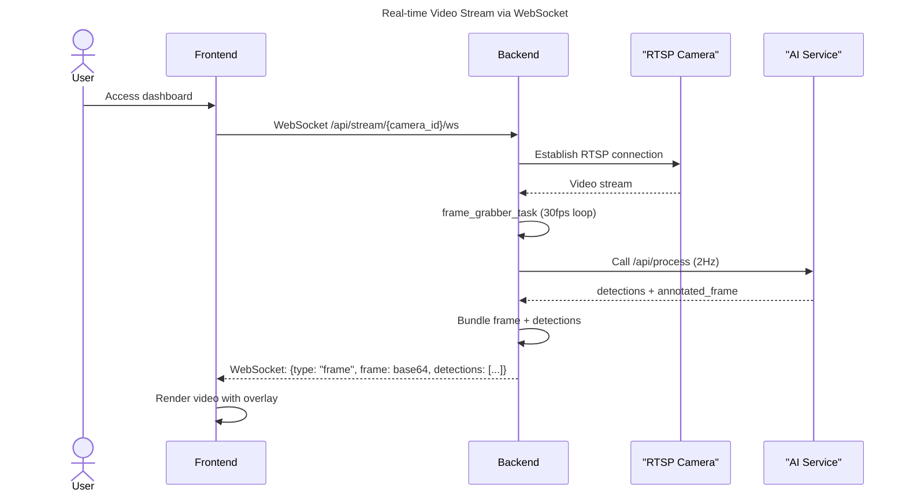

### 1.2 Video Frame Processing Flow

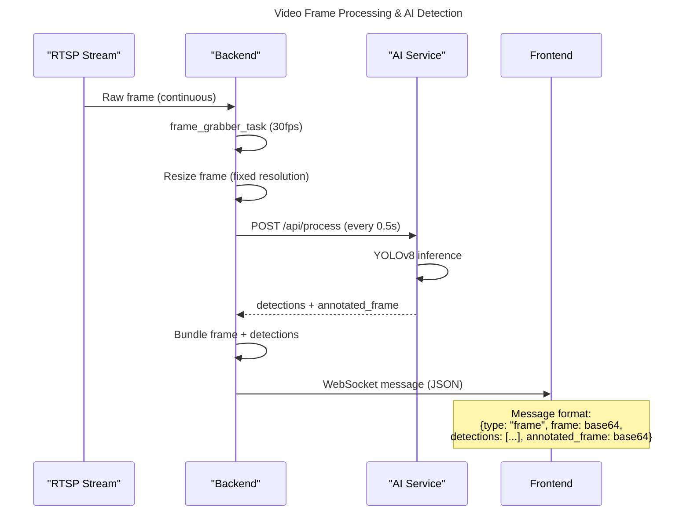

### 1.3 Legacy MJPEG Endpoint (Backward Compatibility)

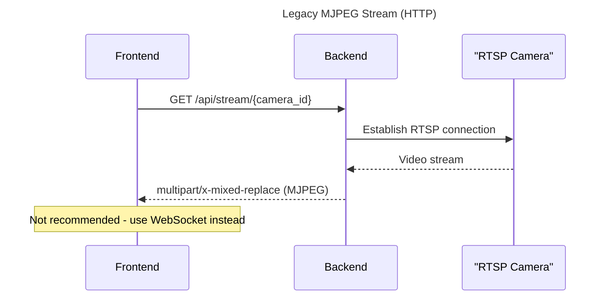

---

## 2. AI Detection Flow

### 2.1 Backend-Initiated AI Detection (Primary)

> **Note:** The backend internally calls the AI service at 2Hz (every 500ms) and bundles results with video frames. Frontend does NOT need to make direct AI calls for real-time detection.

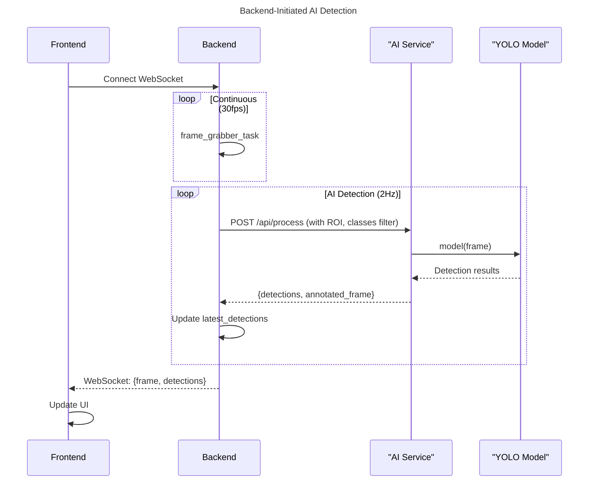

### 2.2 Single Frame AI Analysis (On-Demand)

> For manual "Capture & Analyze" functionality.

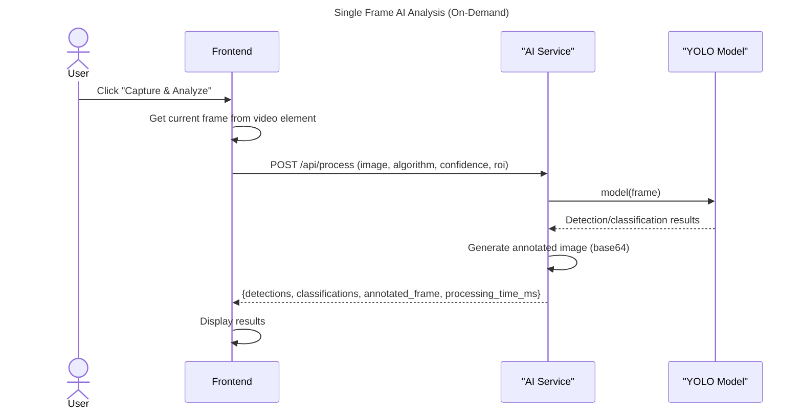

### 2.3 Real-time Detection via WebSocket

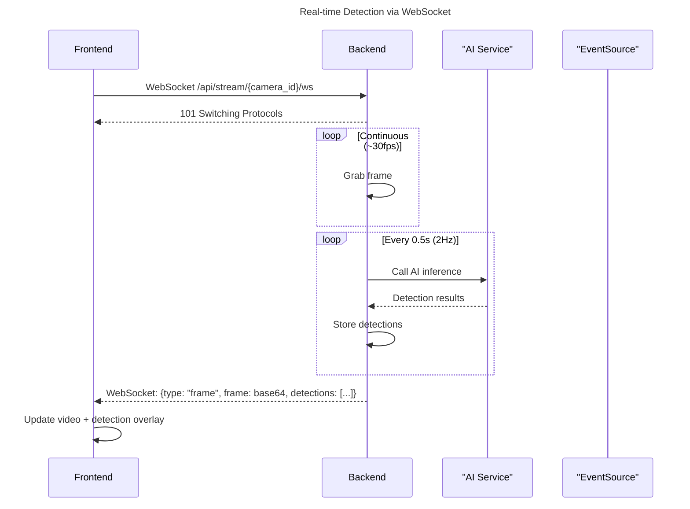

**Key Points:**
- Detection results are embedded in the same WebSocket message as video frames
- No need for separate SSE connection or frontend-initiated AI calls
- Backend throttles AI calls to 2Hz to balance performance and resource usage

### 2.4 Legacy SSE Endpoint (Backward Compatibility)

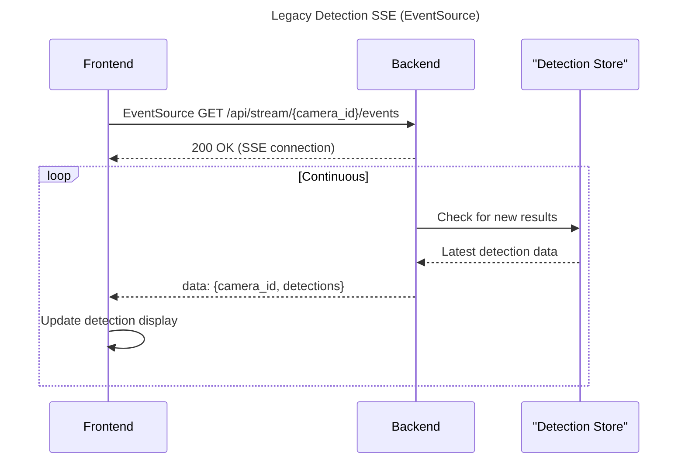

**Note:** The SSE endpoint still exists for backward compatibility but WebSocket is recommended.

---

## 3. Camera Management

### 3.1 Add Camera

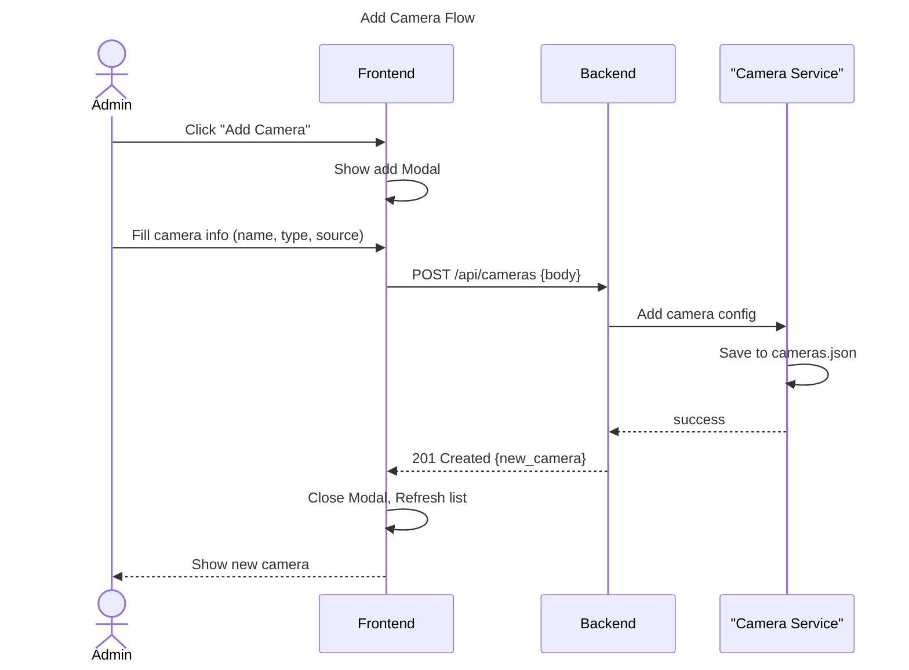

### 3.2 Camera Type Processing

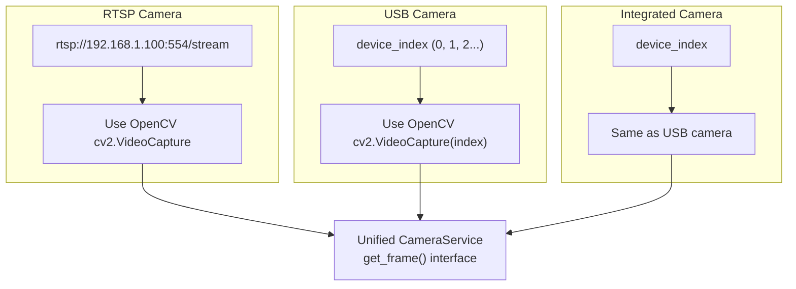

**Note:** All camera types are unified in CameraService, providing a consistent `get_frame()` interface externally.

---

## 4. Event Alerts

### 4.1 Alert Generation and Display

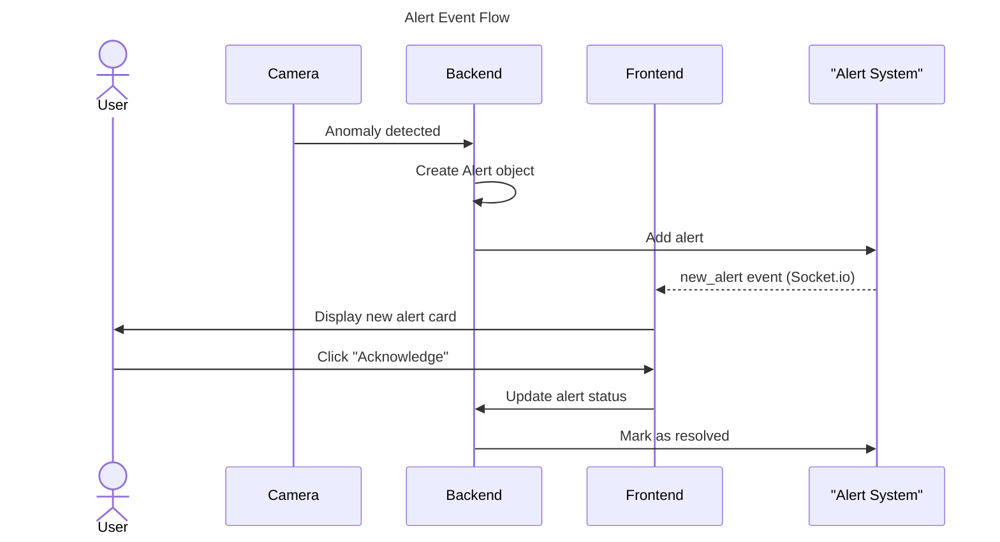

### 4.2 AI Detection Alerts

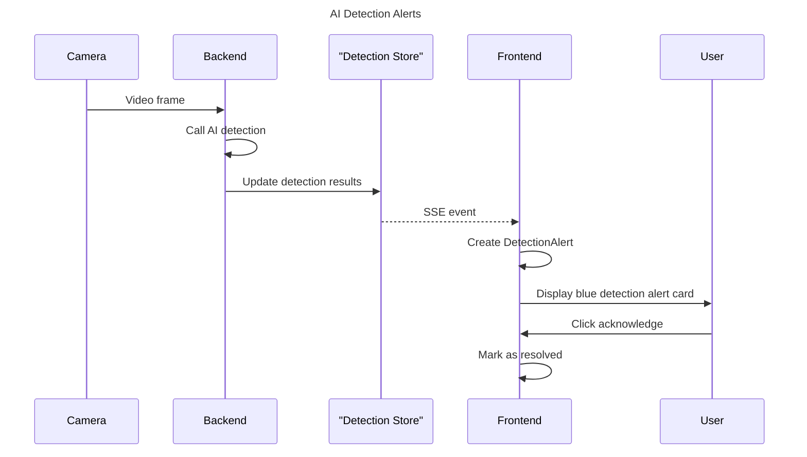

---

## 5. ROI Configuration

### 5.1 ROI Drawing Flow

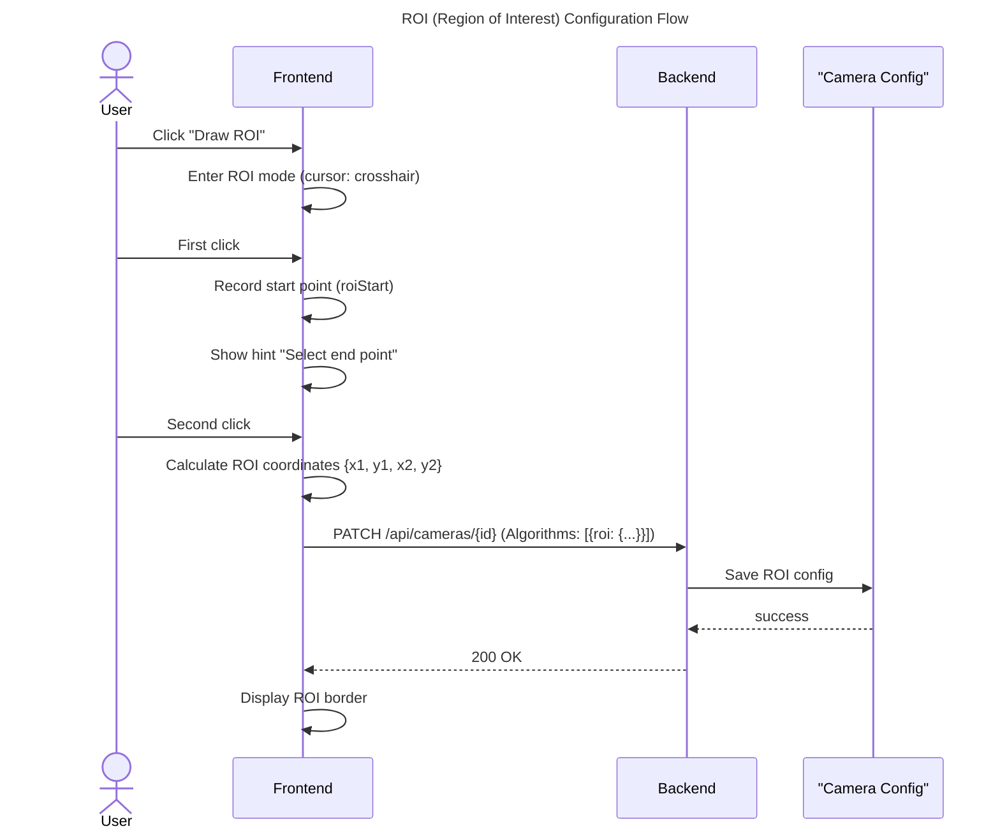

**Note:** Double-click to cancel current selection. ROI coordinates are pixel coordinates (relative to original image).

### 5.2 ROI Processing Flow

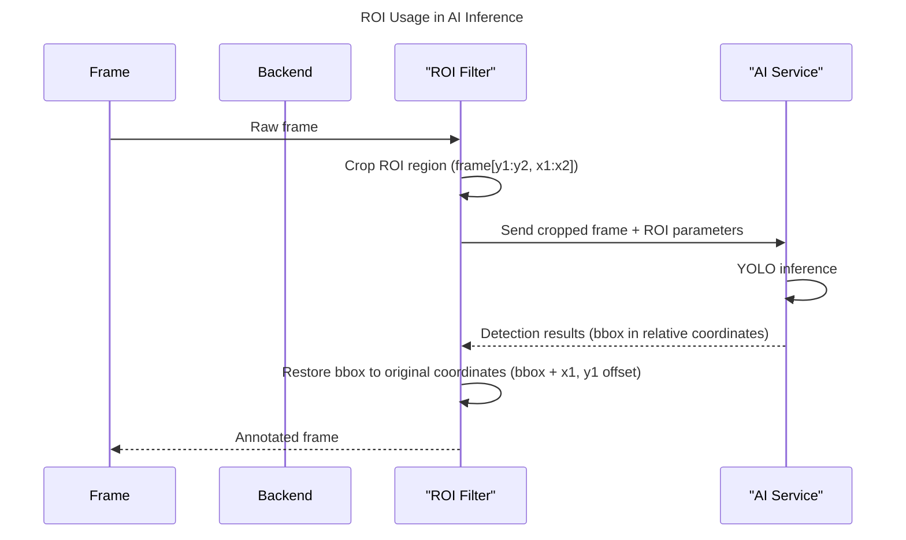

---

## 6. System Initialization

### 6.1 Service Startup Sequence

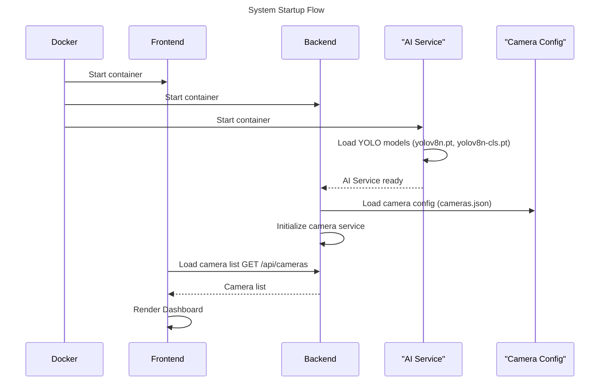

### 6.2 WebSocket Connection Lifecycle

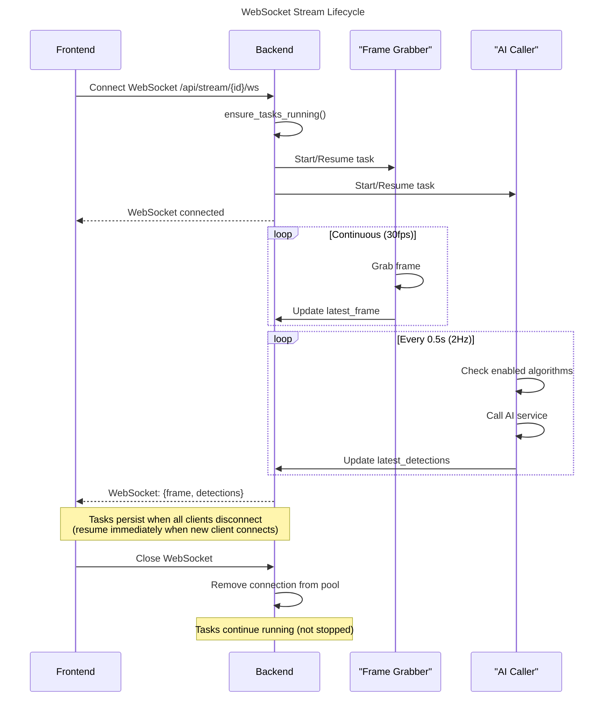

### 6.3 Frontend WebSocket Integration

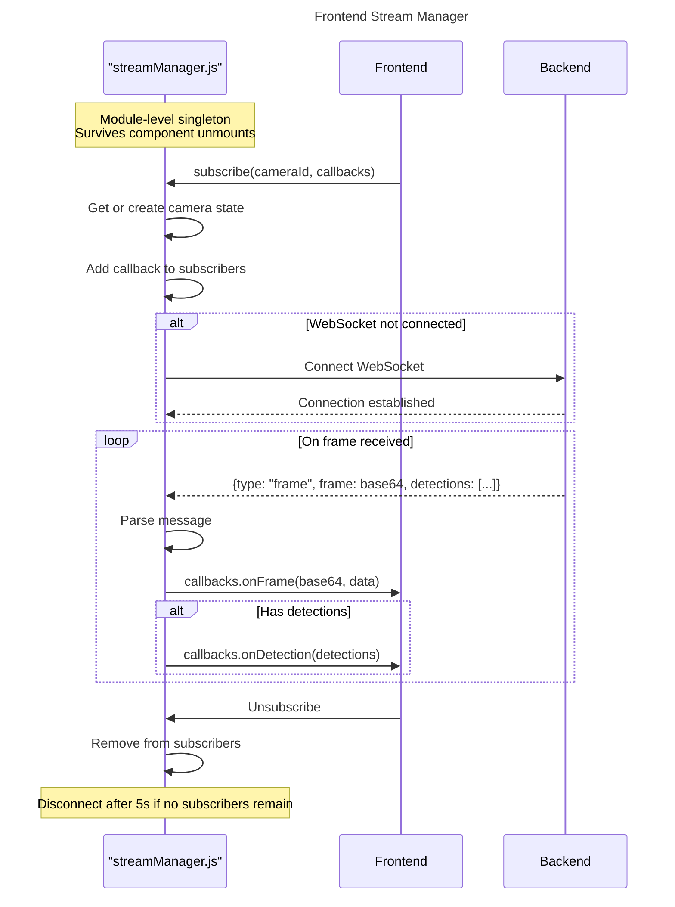

---

## 7. Key Interface Sequence Summary

| Endpoint | Method | Type | Description | Sequence Diagram |
|----------|--------|------|-------------|------------------|
| `/api/stream/{id}/ws` | WebSocket | **Primary** | Live video + AI detection | [WebSocket Stream](#11-real-time-video-stream-via-websocket) |
| `/api/stream/{id}` | GET | HTTP (Legacy) | MJPEG stream | [Legacy MJPEG](#13-legacy-mjpeg-endpoint-backward-compatibility) |
| `/api/stream/{id}/events` | GET | SSE (Legacy) | Real-time detection events | [Legacy SSE](#24-legacy-sse-endpoint-backward-compatibility) |
| `/api/process` | POST | REST | Single frame AI analysis | [On-Demand AI](#22-single-frame-ai-analysis-on-demand) |
| `/api/cameras` | POST | REST | Add camera | [Camera Management](#3-camera-management) |
| `/api/cameras/{id}` | PATCH | REST | Update config | [ROI Configuration](#5-roi-configuration) |

