# Sequence Diagrams

This document presents UML sequence diagrams for core business processes, intended for:
- Confirming business processes with Product Managers
- Explaining integration sequences with the Algorithm Team

---

## Table of Contents

1. [Video Stream Processing](#1-video-stream-processing)
2. [AI Detection Flow](#2-ai-detection-flow)
3. [Camera Management](#3-camera-management)
4. [Event Alerts](#4-event-alerts)
5. [ROI Configuration](#5-roi-configuration)

---

## 1. Video Stream Processing

### 1.1 Real-time Video Stream Retrieval

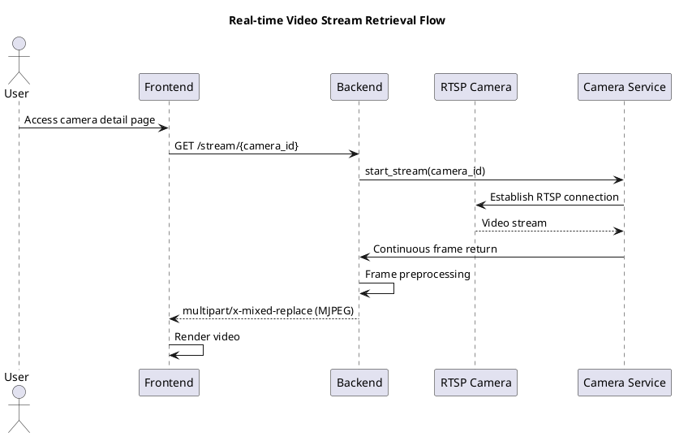

### 1.2 Video Frame Processing Flow

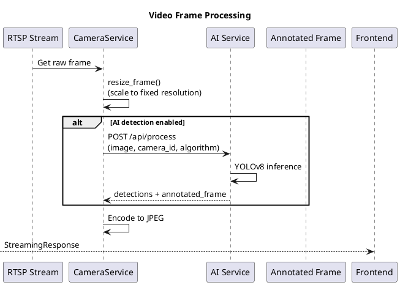

---

## 2. AI Detection Flow

### 2.1 Single Frame AI Analysis

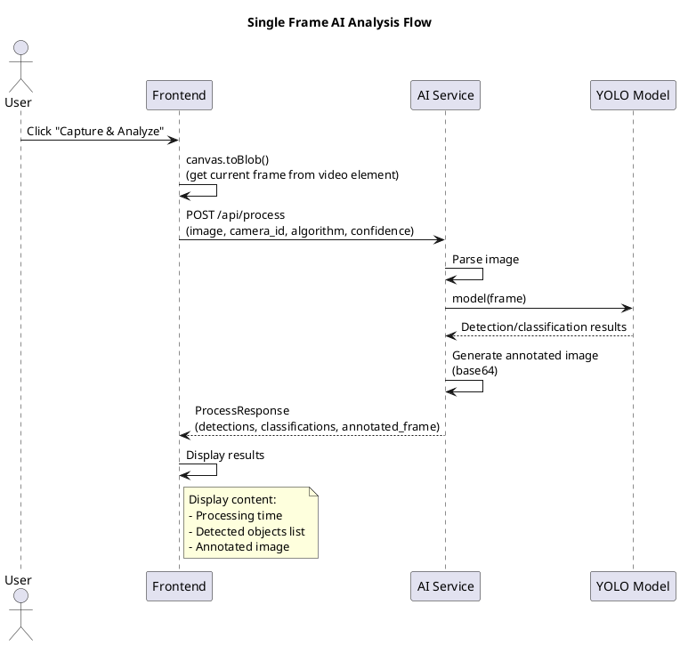

### 2.2 Real-time Detection Stream (EventSource)

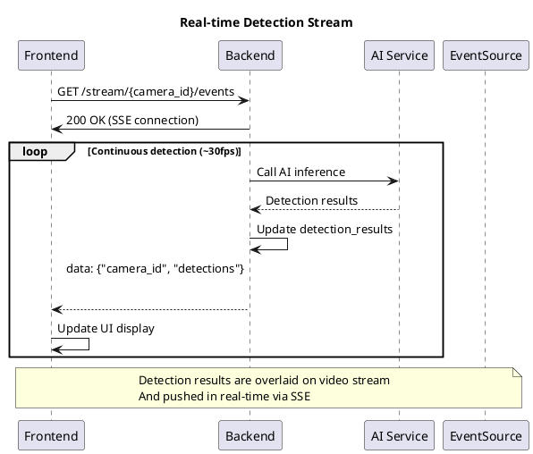

### 2.3 Detection Result Update Mechanism

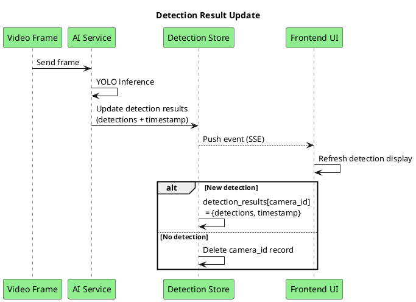

---

## 3. Camera Management

### 3.1 Add Camera

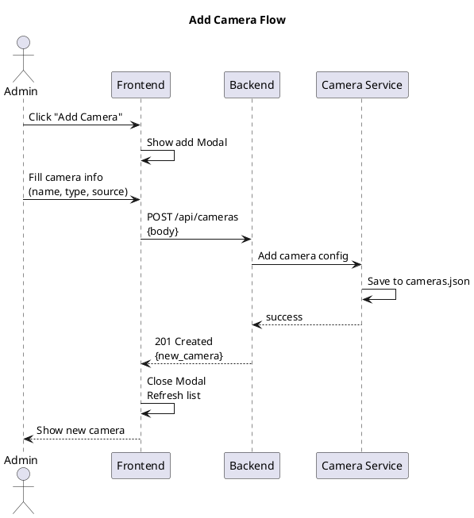

### 3.2 Camera Type Processing

```plantuml
@startuml
title Different Camera Type Processing

partition RTSP Camera {
    :rtsp://192.168.1.100:554/stream;
    -> Use OpenCV cv2.VideoCapture;
}

partition USB Camera {
    :device_index (0, 1, 2...);
    -> Use OpenCV cv2.VideoCapture(index);
}

partition Integrated Camera {
    :device_index;
    -> Same as USB camera;
}

note across
    Unified in CameraService
    Provides unified get_frame() interface externally
end note
@enduml
```

---

## 4. Event Alerts

### 4.1 Alert Generation and Display

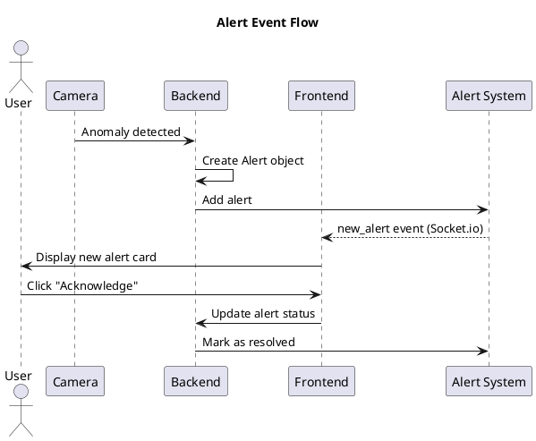

### 4.2 AI Detection Alerts

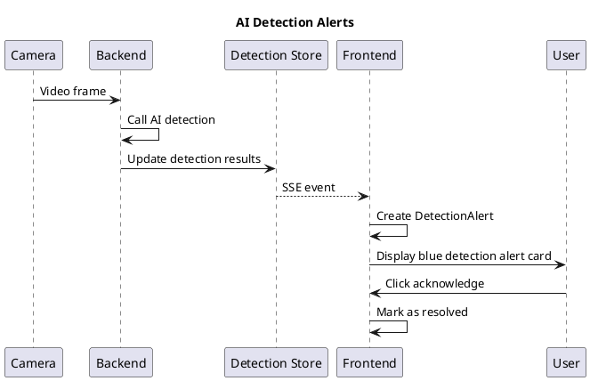

---

## 5. ROI Configuration

### 5.1 ROI Drawing Flow

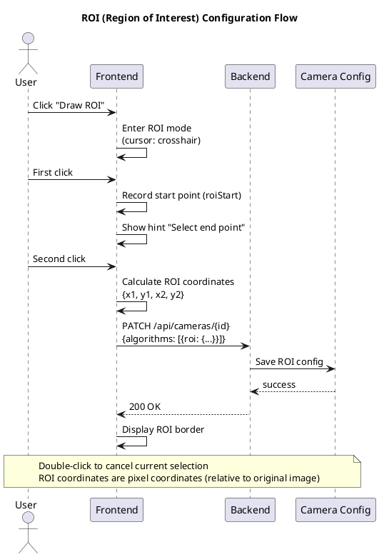

### 5.2 ROI Processing Flow

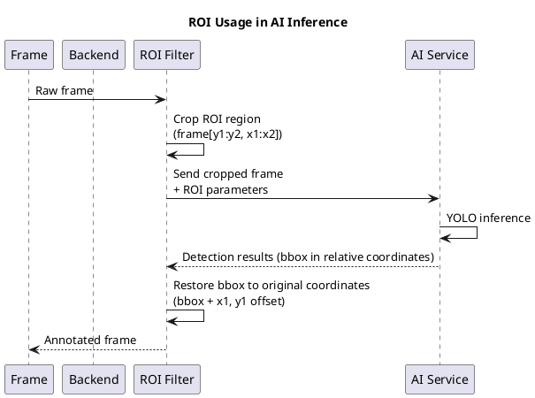

---

## 6. System Initialization

### 6.1 Service Startup Sequence

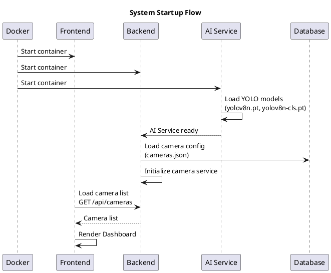

---

## 7. Key Interface Sequence Summary

| Endpoint | Method | Trigger | Sequence Diagram |
|----------|--------|---------|------------------|
| `/stream/{id}` | GET | View camera video | [Video Stream Processing](#1-video-stream-processing) |
| `/stream/{id}/events` | GET | Real-time detection | [Real-time Detection Stream](#22-real-time-detection-stream-eventsource) |
| `/api/process` | POST | Single frame analysis | [AI Detection Flow](#2-ai-detection-flow) |
| `/api/cameras` | POST | Add camera | [Camera Management](#3-camera-management) |
| `/api/cameras/{id}` | PATCH | Update config | [ROI Configuration](#5-roi-configuration) |
